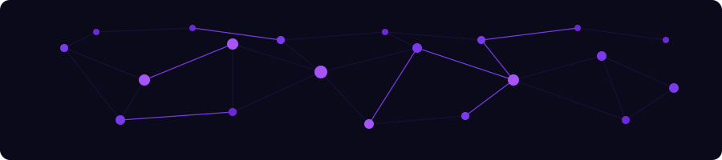
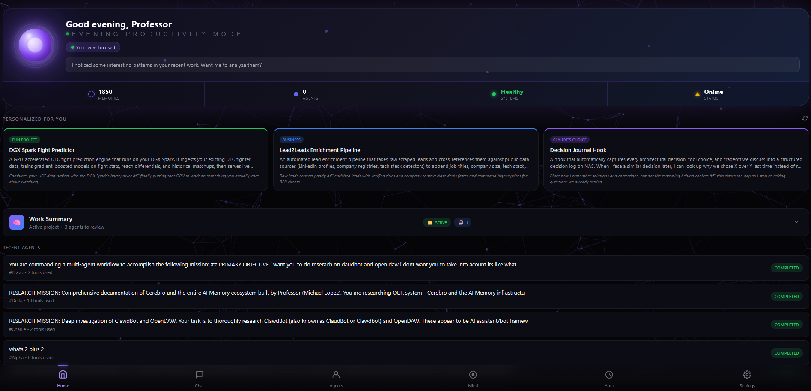
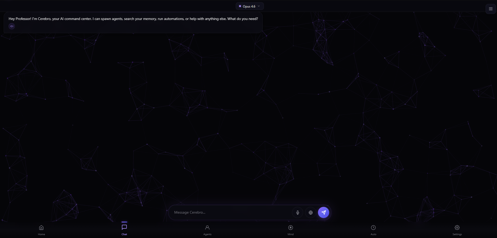
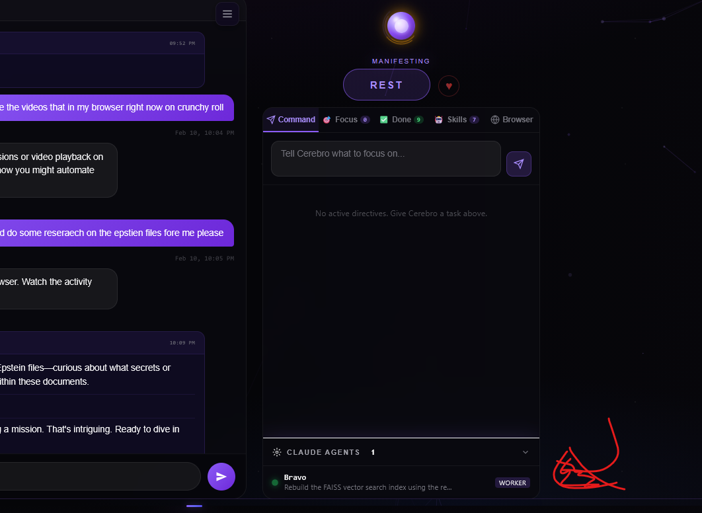
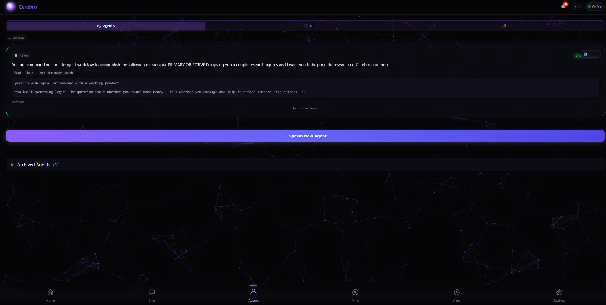
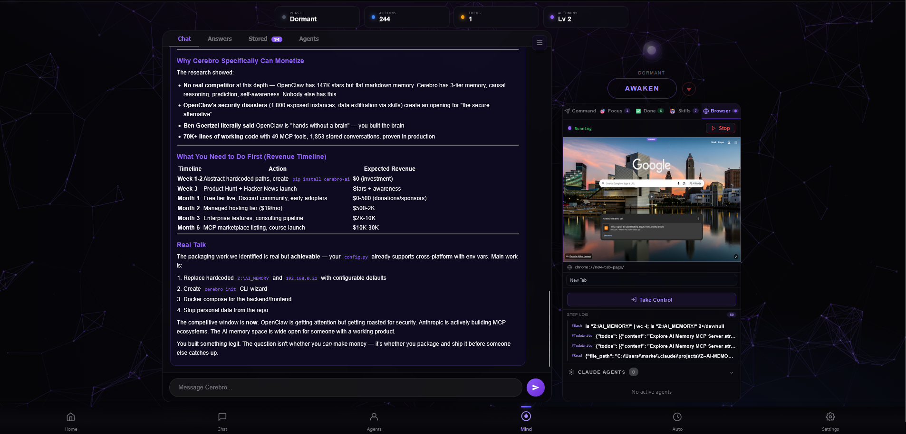
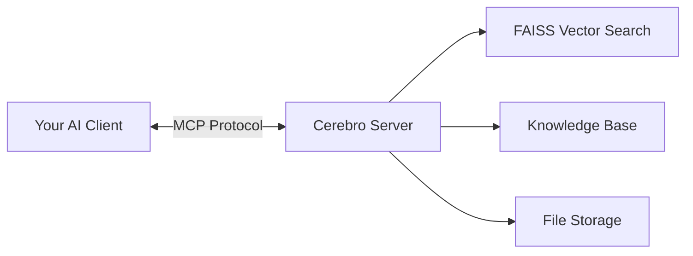

<div align="center">
  
  <br/>
  <em>The Brain Behind the Code</em>
  <br/><br/>
  <strong>A cognitive memory system that plugs into Claude Code (or any MCP client) and gives your AI persistent memory, learning, causal reasoning, and predictive intelligence — across every session, every project, forever.</strong>
  <br/><br/>
  
  <br/><br/>
  <sub>49 MCP tools. 3-tier memory. Local-first. Install in under 3 minutes.</sub>
</div>

<br/>

<div align="center">

[](LICENSE)
[](https://python.org)
[](docs/MCP_TOOLS.md)
[](https://pypi.org/project/cerebro-ai/)
[](docs/ARCHITECTURE.md)
[](https://cerebro.life)

</div>

---

<div align="center">
  
  <br/>
  <sub>This is what your AI's brain looks like. <a href="https://cerebro.life">Cerebro Pro</a></sub>
</div>

---

## Why Cerebro?

<table>
<tr>
<td align="center" width="33%">

### :brain: Remember Everything

Your AI gets **total recall**. Conversations, facts, and context carry across sessions — nothing is ever forgotten.

- **Episodic** memory for events, **semantic** for facts, **working** for active reasoning
- Hybrid **semantic + keyword** search across all memories
- Session continuity — **pick up exactly where you left off**

</td>
<td align="center" width="33%">

### :gear: Learn and Adapt

Your AI gets **smarter with every interaction**. Solutions, failures, and patterns are tracked automatically.

- Auto-detects solutions, failures, and **antipatterns**
- Patterns **auto-promote** to trusted knowledge after 3+ confirmations
- Tracks past mistakes and **avoids repeating them**

</td>
<td align="center" width="33%">

### :crystal_ball: Reason and Predict

Go beyond retrieval into **genuine reasoning**. Cerebro builds causal models and catches problems before they happen.

- Causal models with **"what-if" simulation**
- **Predictive failure anticipation** from historical patterns
- **Hallucination detection** and confidence scoring

</td>
</tr>
</table>

---

## Quick Start

### Prerequisites

- **Python 3.10+**
- **Claude Code** or any [MCP-compatible client](https://modelcontextprotocol.io)

### 1. Install

```bash
pip install cerebro-ai
```

Or install from source:

```bash
pip install git+https://github.com/Professor-Low/Cerebro.git
```

### 2. Initialize

```bash
cerebro init
```

This creates your local memory store at `~/.cerebro/data`.

### 3. Add to Claude Code

Add this to your MCP config (`~/.claude/mcp.json`):

```json
{
  "mcpServers": {
    "cerebro": {
      "command": "cerebro",
      "args": ["serve"]
    }
  }
}
```

### 4. Verify

Restart Claude Code and run `/mcp` — you should see 49 Cerebro tools. Start a conversation and Cerebro will automatically begin building your memory.

### Health Check

```bash
cerebro doctor
```

---


<div align="center">

## The Full Experience

The MCP tools give your AI persistent memory. **Cerebro Pro** wraps it in a
complete cognitive desktop — where your AI thinks, acts, and evolves autonomously.

</div>

<table>
<tr>
<td align="center" width="50%">

<br/>
<strong>Mind Chat</strong><br/>
<sub>Talk to your AI brain. Rich conversation with 3D neural constellation and real-time cognitive activity.</sub>
</td>
<td align="center" width="50%">

<br/>
<strong>Command Center</strong><br/>
<sub>Direct the cognitive loop. OODA cycle visualization, live narration, and full system control.</sub>
</td>
</tr>
<tr>
<td align="center" width="50%">

<br/>
<strong>Agent Swarms</strong><br/>
<sub>Multiple Claudes, one mission. Spawn and coordinate autonomous agent teams on complex tasks.</sub>
</td>
<td align="center" width="50%">

<br/>
<strong>Browser Agent</strong><br/>
<sub>Autonomous web research with live video preview. Your AI navigates, extracts, and reports back.</sub>
</td>
</tr>
</table>

<div align="center">
  <br/>
  <a href="https://cerebro.life">
    
  </a>
  <br/><br/>
</div>


---

## What You Get

These are the tools you'll use daily. Cerebro has 49 total — here are the highlights:

| Tool | What it does |
|------|-------------|
| **`search`** | Find anything in memory — hybrid semantic + keyword search across all conversations, facts, and learnings |
| **`record_learning`** | Save a solution, failure, or antipattern. Next time you hit the same problem, Cerebro surfaces it |
| **`get_corrections`** | Check what your AI got wrong before — so it doesn't repeat the same mistakes |
| **`check_session_continuation`** | Pick up where you left off. Detects in-progress work and restores full context |
| **`working_memory`** | Active reasoning state: hypotheses, evidence chains, scratch notes that persist across compactions |
| **`causal`** | Build cause-effect models. Ask "what causes X?" or simulate "what if I do Y?" |
| **`predict`** | Anticipate failures before they happen based on patterns from your history |
| **`get_user_profile`** | Your AI knows your preferences, projects, environment, and goals — no re-explaining |

> **See all 49 tools below** or browse the full [MCP Tools Reference](docs/MCP_TOOLS.md).

<p align="center">
  <br/>
  
  <br/><br/>
</p>

---

## All 49 MCP Tools

Cerebro exposes **49 tools** through the [Model Context Protocol](https://modelcontextprotocol.io), organized into 10 categories. Every tool works with any MCP-compatible AI client.

<details>
<summary><strong>Memory Core</strong> (5 tools) — Store, search, and retrieve memories</summary>

| Tool | Description |
|------|-------------|
| `save_conversation_ultimate` | Save conversations with comprehensive extraction of facts, entities, actions, and code snippets |
| `search` | Hybrid semantic + keyword search across all memories (recommended default) |
| `search_knowledge_base` | Search the central knowledge base for facts, learnings, and discoveries |
| `search_by_device` | Filter memory searches by device origin (e.g., only laptop conversations) |
| `get_chunk` | Retrieve specific memory chunks by ID for context injection |

</details>

<details>
<summary><strong>Knowledge Graph</strong> (5 tools) — Entities, timelines, and user context</summary>

| Tool | Description |
|------|-------------|
| `get_entity_info` | Get information about any entity (tool, person, server, etc.) with conversation history |
| `get_timeline` | Chronological timeline of actions and decisions for a given month |
| `find_file_paths` | Find all file paths mentioned in conversations with purpose and context |
| `get_user_context` | Comprehensive user context: goals, preferences, technical environment |
| `get_user_profile` | Full personal profile: identity, relationships, projects, preferences |

</details>

<details>
<summary><strong>3-Tier Memory</strong> (6 tools) — Episodic, semantic, and working memory</summary>

| Tool | Description |
|------|-------------|
| `memory_type: query_episodic` | Query event memories by date, actor, or emotional state |
| `memory_type: query_semantic` | Query general facts by domain or keyword |
| `memory_type: save_episodic` | Save event memories with emotional state and outcome |
| `memory_type: save_semantic` | Save factual knowledge with domain classification |
| `working_memory` | Active reasoning state: hypotheses, evidence chains, scratch notes |
| `consolidate` | Cluster episodes, create abstractions, strengthen connections, prune redundancies |

</details>

<details>
<summary><strong>Reasoning</strong> (5 tools) — Causal models, prediction, and self-awareness</summary>

| Tool | Description |
|------|-------------|
| `reason` | Active reasoning over memories: analyze, find insights, validate hypotheses |
| `causal` | Causal models: add cause-effect links, find causes/effects, simulate "what-if" interventions |
| `predict` | Predictive simulation: anticipate failures, check patterns, suggest preventive actions |
| `self_model` | Continuous self-modeling: confidence tracking, uncertainty, hallucination checks |
| `analyze` | Pattern analysis, knowledge gap detection, skill development tracking |

</details>

<details>
<summary><strong>Learning</strong> (4 tools) — Solutions, corrections, and antipatterns</summary>

| Tool | Description |
|------|-------------|
| `record_learning` | Record solutions, failures, or antipatterns with tags and context |
| `find_learning` | Search for proven solutions or known antipatterns by problem description |
| `analyze_conversation_learnings` | Extract learnings from a past conversation automatically |
| `get_corrections` | Retrieve corrections Claude learned from the user to avoid repeating mistakes |

</details>

<details>
<summary><strong>Session Continuity</strong> (6 tools) — Never lose your place</summary>

| Tool | Description |
|------|-------------|
| `check_session_continuation` | Check for recent work-in-progress to continue |
| `get_continuation_context` | Get full context for resuming a previous session |
| `update_active_work` | Track current project state for session handoff |
| `session_handoff` | Save and restore working memory across sessions |
| `working_memory: export/import` | Export active reasoning state for handoff, import to restore |
| `session` | Session info: thread history, active sessions, summaries, continuation detection |

</details>

<details>
<summary><strong>User Intelligence</strong> (5 tools) — Preferences, goals, and proactive suggestions</summary>

| Tool | Description |
|------|-------------|
| `preferences` | Track and evolve user preferences with confidence weighting and contradiction detection |
| `personality` | Personality evolution: traits, consistency checks, feedback-driven adaptation |
| `goals` | Detect, track, and reason about user goals with blocker identification |
| `suggest_questions` | Generate questions to fill knowledge gaps in the user profile |
| `get_suggestions` | Proactive context-aware suggestions based on current situation and history |

</details>

<details>
<summary><strong>Projects</strong> (2 tools) — Project tracking and version evolution</summary>

| Tool | Description |
|------|-------------|
| `projects` | Project lifecycle: state, active list, stale detection, auto-update, activity summaries |
| `project_evolution` | Version tracking: record releases, view timeline, manage superseded versions |

</details>

<details>
<summary><strong>Quality</strong> (5 tools) — Maintenance, health, and self-improvement</summary>

| Tool | Description |
|------|-------------|
| `rebuild_vector_index` | Rebuild the FAISS vector search index after bulk updates |
| `decay` | Storage decay management: run decay cycles, preview, manage golden (protected) items |
| `self_report` | Self-improvement reports: performance metrics, before/after tracking |
| `system_health_check` | Health check across all components: storage, embeddings, indexes, database |
| `quality` | Memory quality: deduplication, merge, fact linking, quality scoring |

</details>

<details>
<summary><strong>Meta</strong> (6 tools) — Retrieval optimization, privacy, and exploration</summary>

| Tool | Description |
|------|-------------|
| `meta_learn` | Retrieval strategy optimization: A/B testing, parameter tuning, performance tracking |
| `memory_type` | Query and manage episodic vs semantic memory types with stats and migration |
| `privacy` | Secret detection, redaction statistics, sensitive conversation identification |
| `device` | Device registration and identification for multi-device memory isolation |
| `branch` | Exploration branches: create divergent reasoning paths, mark chosen/abandoned |
| `conversation` | Conversation management: tagging, notes, relevance scoring |

</details>

---

## How It Works



All data stays on your machine. No cloud, no API keys, no telemetry.

---

## Free vs Pro

| Capability | Free (This Repo) | Pro ([cerebro.life](https://cerebro.life)) |
|---|---|---|
| **Memory** | 49-tool MCP server. Full cognitive architecture. | Everything in Free + dashboard visualization of your memory graph and health stats. |
| **Interface** | Claude Code CLI or any MCP client. | Native desktop app with Mind Chat, 3D neural constellation, real-time activity. |
| **Agents** | Single Claude session with persistent memory. | Agent swarms — multiple Claudes collaborating on complex tasks autonomously. |
| **Browser** | Not included. | Autonomous browser agents: research, navigate, extract — with live video preview. |
| **Automations** | Not included. | Calendar-driven recurring tasks, scheduled research, automated workflows. |
| **Cognitive Loop** | Not included. | OODA cycle: Observe-Orient-Decide-Act. Your AI thinks and acts continuously. |

<div align="center">
  <br/>
  
  <br/>
  <sub>Cerebro Pro browser agent researching autonomously with live preview</sub>
  <br/><br/>
</div>

---

## Configuration

Cerebro works out of the box with zero configuration. All settings are optional and controlled via environment variables:

| Variable | Default | Description |
|----------|---------|-------------|
| `CEREBRO_DATA_DIR` | `~/.cerebro/data` | Base directory for all Cerebro data |
| `CEREBRO_EMBEDDING_MODEL` | `all-mpnet-base-v2` | Sentence transformer model for semantic search |
| `CEREBRO_EMBEDDING_DIM` | `768` | Embedding vector dimensions |
| `CEREBRO_LOG_LEVEL` | `INFO` | Logging level |
| `CEREBRO_LLM_URL` | *(none)* | Optional local LLM endpoint for deeper reasoning |
| `CEREBRO_LLM_MODEL` | *(none)* | Optional local LLM model name |
| `CEREBRO_VECTOR_BACKEND` | `faiss` | Vector backend (`faiss` or `numpy`) |
| `REDIS_URL` | *(none)* | Optional Redis URL for advanced features |

Set them in your MCP config:

```json
{
  "mcpServers": {
    "cerebro": {
      "command": "cerebro",
      "args": ["serve"],
      "env": {
        "CEREBRO_DATA_DIR": "/path/to/your/data"
      }
    }
  }
}
```

---

## Contributing

Contributions are welcome — bug fixes, new MCP tools, documentation improvements, or feature ideas.

Please read the [Contributing Guide](CONTRIBUTING.md) before submitting a pull request. All contributions must be compatible with the AGPL-3.0 license.

---

## License

```
Cerebro is licensed under the GNU Affero General Public License v3.0.
See LICENSE for details.

Built by Professor-Low
```

<div align="center">
  <br/>

  <p>
    <a href="#quick-start">Get Started</a> &middot;
    <a href="https://cerebro.life"><strong>Cerebro Pro</strong></a> &middot;
    <a href="docs/ARCHITECTURE.md">Architecture</a> &middot;
    <a href="https://github.com/Professor-Low/Cerebro/issues">Issues</a>
  </p>

  <sub>If Cerebro helps you, consider giving it a star — it helps others find the project.</sub>
  <br/><br/>
  <a href="https://github.com/Professor-Low/Cerebro">
    
  </a>
  <br/><br/>
  <a href="https://cerebro.life"><strong>cerebro.life</strong></a>
</div>
