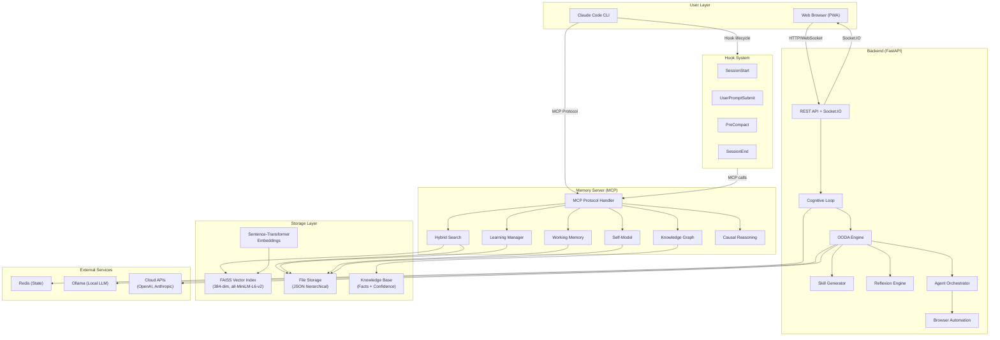
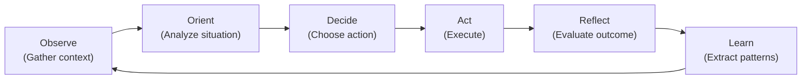
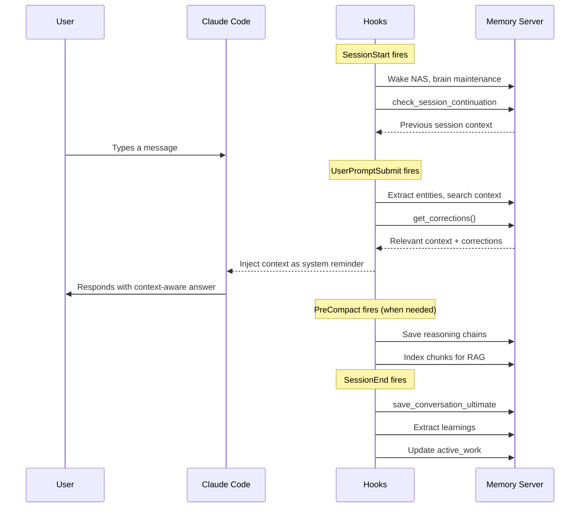

# Cerebro Architecture

> A comprehensive overview of Cerebro's cognitive architecture

## System Overview

Cerebro is a modular cognitive platform comprising 4 core components that work together to give AI persistent memory, reasoning, and learning capabilities. It transforms Claude Code from a stateless assistant into a continuously learning system with long-term memory, contextual awareness, and autonomous skill acquisition.



## Component Deep Dives

### 1. Memory Server (49 MCP Tools)

The Memory Server is the cognitive backbone of Cerebro. It exposes 49 tools via the Model Context Protocol (MCP), giving Claude Code persistent memory across sessions.

#### 3-Tier Memory Architecture

| Tier | Purpose | Storage | Retrieval |
|------|---------|---------|-----------|
| **Episodic** | What happened (events, conversations, actions) | JSON files by date | Date range, actor, emotion filters |
| **Semantic** | What is known (facts, entities, relationships) | Knowledge base with confidence | Domain, keyword, hybrid search |
| **Working** | Active reasoning state (hypotheses, evidence) | Session-scoped JSON | Current session context |

#### FAISS Vector Search

- **Model**: `all-MiniLM-L6-v2` (384-dimensional embeddings)
- **Index type**: FAISS IndexFlatIP (inner product similarity)
- **Chunking**: Conversations split into semantic chunks for granular retrieval
- **Hybrid search**: Combines FAISS semantic similarity with BM25 keyword matching
- **Alpha parameter**: Tunable weight between semantic (1.0) and keyword (0.0) results

#### Knowledge Base

- Facts extracted from conversations with confidence scores (0.0-1.0)
- Provenance tracking: every fact traces back to its source conversation
- Contradiction detection: new facts checked against existing knowledge
- Confidence decay: unused facts gradually lose confidence over time
- Reinforcement: confirmed facts gain confidence through repeated observation

#### Privacy & Security

- Secret detection scans all text before storage
- Redaction of API keys, passwords, credentials, and PII
- Sensitive conversation flagging
- No external data transmission (all processing local)

#### Cross-Platform Support

- Windows (primary), Linux, macOS
- NAS/network storage support via mounted drives
- Path normalization across platforms

### 2. Backend (FastAPI + Cognitive Loop)

The Backend provides the web interface, cognitive processing, and agent orchestration capabilities.

#### OODA Loop (Observe-Orient-Decide-Act-Reflect-Learn)



- **Observe**: Gather current state, browser content, user input
- **Orient**: Analyze context using memory, skills, and past experience
- **Decide**: Select the best action from available options
- **Act**: Execute the chosen action (browse, code, research, etc.)
- **Reflect**: Evaluate the outcome against expectations
- **Learn**: Extract reusable patterns and update skills

#### 5 Autonomy Levels

| Level | Name | Description |
|-------|------|-------------|
| 0 | **Manual** | User controls every action |
| 1 | **Supervised** | AI suggests, user approves |
| 2 | **Guided** | AI acts with user oversight |
| 3 | **Autonomous** | AI acts independently, reports results |
| 4 | **Full Auto** | AI operates without intervention |

#### Browser Automation

- Playwright-based browser control with self-healing locators
- HTTP API for agent-driven browsing (no separate browser per agent)
- Page understanding via `PageUnderstanding.analyze_page()`
- Compressed page state with numbered interactive elements
- Screenshot capture for visual verification

#### Skill Generation (Voyager Pattern)

Inspired by the Voyager paper, Cerebro generates reusable skills from successful task completions:

1. Task completed successfully
2. Extract action sequence and context
3. Generate fingerprint for matching future similar tasks
4. Store skill as JSON with metadata
5. Future matching tasks use stored skill instead of reasoning from scratch

#### Agent Orchestration

- Multiple agent types: browser, coder, researcher, worker
- Keyword-based classification dispatches to appropriate agent
- Claude Code CLI agents replace slow local LLM processing
- Narration streaming for real-time visibility into agent reasoning

### 3. Frontend (PWA)

The Frontend is a Progressive Web App providing a visual interface to Cerebro's cognitive processes.

#### Purple Orb Interface

- Animated neural network visualization reflecting cognitive activity
- Phase badges showing current OODA state
- Real-time thought streaming via Socket.IO
- Responsive design for desktop and mobile

#### Key Features

- **Mind Chat**: Rich chat interface with DOMPurify sanitization
- **Model Selector**: Switch between local Ollama models and cloud APIs
- **Memory Visualization**: Browse and search stored memories
- **Directive Input**: Submit tasks for autonomous processing
- **HITL Popup**: Human-in-the-loop dialog for agent questions

#### Real-Time Communication

All frontend updates flow through Socket.IO events:

| Event | Direction | Purpose |
|-------|-----------|---------|
| `cerebro_narration` | Server → Client | Agent reasoning text |
| `browser_step` | Server → Client | Browser automation actions |
| `ooda_update` | Server → Client | Cognitive loop phase changes |
| `mind_chat` | Bidirectional | Chat messages |
| `agent_question` | Server → Client | HITL questions for user |

### 4. Hooks (Claude Code Lifecycle)

Hooks integrate Cerebro's memory system directly into Claude Code's lifecycle, making memory access transparent and automatic.

#### Hook Lifecycle



## Data Flow

### How a User Message Flows Through Cerebro

```
1. User types in Claude Code
       │
       ▼
2. UserPromptSubmit hook fires
   ├── Extract entities and keywords from message
   ├── Search memory for relevant context (hybrid search)
   ├── Check corrections (avoid past mistakes)
   ├── Detect breakthroughs ("It works!", "Finally!")
   └── Inject context as system reminder
       │
       ▼
3. Claude processes message with injected context
   ├── Memory-enriched understanding
   ├── Correction-aware responses
   └── Contextual awareness of past sessions
       │
       ▼
4. Claude responds to user
       │
       ▼
5. If breakthrough detected:
   ├── Auto-save learning (problem + solution)
   ├── Record to knowledge base
   └── Update confidence scores
       │
       ▼
6. SessionEnd (when session closes):
   ├── Save full conversation
   ├── Extract all learnings
   ├── Update active_work state
   └── Run consolidation if needed
       │
       ▼
7. Background maintenance (periodic):
   ├── FAISS index rebuild
   ├── Confidence decay
   ├── Pattern promotion (3+ occurrences → promoted)
   ├── Stale pattern archival (90+ days unused)
   └── Duplicate detection and merging
```

## Storage Architecture

### Directory Structure

```
Z:\AI_MEMORY\                          # Root storage (NAS or local)
├── quick_facts.json                   # Instant recall (auto-synced)
├── conversations/                     # Episodic memory
│   └── YYYY/MM/DD/                    # Hierarchical by date
│       └── conv_<id>.json             # Full conversation + metadata
├── chunks/                            # RAG chunks for search
│   └── <chunk_id>.json                # Individual searchable chunks
├── knowledge_base/                    # Semantic memory
│   ├── facts.json                     # Extracted facts + confidence
│   ├── entities.json                  # Named entities + relationships
│   └── corrections.json              # Known mistakes to avoid
├── learnings/                         # Learning system
│   ├── solutions.json                 # Proven solutions
│   ├── failures.json                  # Failed approaches
│   └── antipatterns.json             # What NOT to do
├── embeddings/                        # Vector search
│   ├── faiss_index.bin               # FAISS index (384-dim)
│   └── metadata.json                 # Chunk-to-embedding mapping
├── sessions/                          # Working memory
│   ├── active/                        # Current session state
│   └── handoffs/                      # Session handoff data
├── user_profile/                      # User intelligence
│   ├── profile.json                   # Identity, preferences, goals
│   └── personality.json              # Communication style evolution
├── projects/                          # Project tracking
│   └── <project_id>/                 # Per-project state
├── cerebro/                           # Cerebro-specific
│   ├── skills/                        # Generated skills (Voyager)
│   │   ├── *.json                    # Skill definitions
│   │   └── fingerprints/             # Skill matching fingerprints
│   └── heartbeat_config.json        # Heartbeat system config
└── cache/                             # Temporary caches
    ├── session_summaries/
    └── identity_core/
```

### Embedding Pipeline

```
Text Input
    │
    ▼
Sentence-Transformer (all-MiniLM-L6-v2)
    │
    ▼
384-dimensional vector
    │
    ▼
FAISS IndexFlatIP
    │
    ▼
Stored with metadata:
  - chunk_id
  - conversation_id
  - timestamp
  - chunk_type (message, fact, file_path, etc.)
```

### Search Pipeline

```
Query
    │
    ├──────────────────┐
    ▼                  ▼
Semantic Search    Keyword Search
(FAISS cosine)     (BM25 scoring)
    │                  │
    └────────┬─────────┘
             ▼
    Hybrid Ranking
    (alpha-weighted)
             │
             ▼
    Results with scores
    (filtered, deduplicated)
```

## Integration Points

### MCP Protocol

Cerebro's Memory Server communicates via the Model Context Protocol (MCP):

- **Transport**: stdio (for Claude Code integration)
- **Tools**: 49 registered tools across 10 categories
- **Schema**: JSON Schema for all parameters
- **Async**: Full async/await support

### Socket.IO Events

The Backend communicates with the Frontend via Socket.IO:

- **Namespace**: Default (`/`)
- **Room**: `professor` (authenticated user)
- **Events**: Real-time narration, browser steps, OODA updates, chat

### HTTP API

The Backend exposes REST endpoints for:

- Browser control (page state, click, fill, scroll, etc.)
- Agent HITL (ask/answer blocking endpoints)
- Health checks
- Configuration management

## Design Principles

1. **Memory-First**: Always check memory before reasoning from scratch
2. **Privacy-First**: All data stays local; secret detection before storage
3. **Graceful Degradation**: Works without NAS, without LLM, without browser
4. **Continuous Learning**: Every session makes the system smarter
5. **Transparency**: All cognitive processes are observable and auditable
6. **Modularity**: Each component works independently and can be replaced
